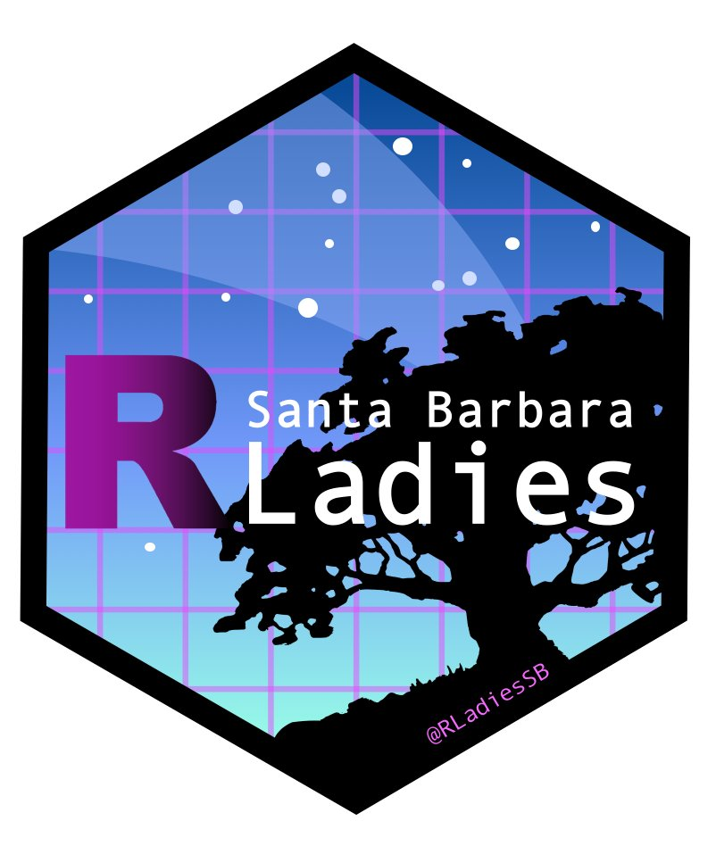

Gosh am I grateful for the R-Ladies+ community! Thanks to the Santa Barbara crew of this incredible global network, I came across a terrific tutorial from [Sam Shanny-Csik](https://samanthacsik.github.io/): "Creating your personal website using Quarto" [published at URL](https://samanthacsik.github.io/RLadiesSB-quarto-websites/).

I've been in the weeds with Quarto for a couple years now, most recently iterating resumes and cover letters during my job search. And of course Jorge and I used Quarto extensively during our time together with HISD (teamwork!). But I was a little reluctant to build out a Quarto website and deploy through GitHub pages until I found Sam's resources.

Do I need to do a bit more work in updating fonts and colors? Probably. Do I need to remove the lingering placeholder text on the Resources page? Of course.

But for the moment I'm up and running in under 90 minutes start to finish. Hooray!

[{fig-alt="Hex logo for R Ladies Santa Barbara California" width=35% fig-align="left"}](https://www.meetup.com/rladies-santa-barbara/)
